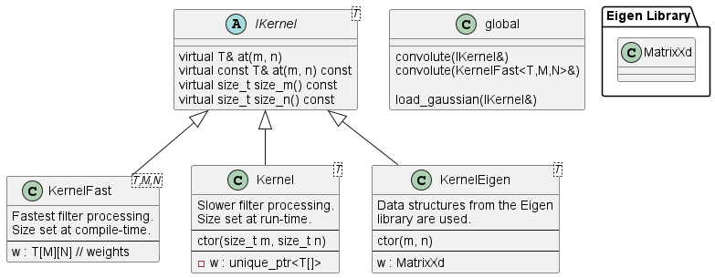

## Requirements
 - Kernels shall be of size `m x n` and stored in row-order.
   - `m` is number of rows, `n` is number of columns.
   - This is the standard mathematical notation and also the standard way
     arrays are laid out in computer memory.
 - Kernel element access should be done with the variable names `m` and `n` with
   their meanings as given above.
   - Avoid using names such as `x` and `y` when working within kernel space.
 

## Design

