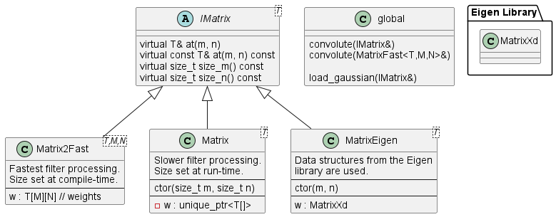

The library's matrix classes are limited in their features as they are generally filled out
and completed depending on project needs. However, the matrix classes should be designed and
completed with the long term goal of being an in-house matrix library. If a more complete
matrix operation set is needed, look to using the third-party *Eigen* library as a stopgap
measure.

## Requirements
 - The following kernel types are provided by our matrix library.
   - `IMatrix` - Generic interface for matrix classes.
     - *NOTE: Preferably, all matrix classes will inherit this interface so that non-performance
              critical code can be written generally (such as our `load_gaussian` function).
              There may be limitations on what general operations `IMatrix` defines as we are
              focused on making `Matrix2Fast` performant and need to avoid un-inlineable
              virtual function calls.*
       - *It appears compilers are allowed to inline virtual function calls if it knows the
         exact type of the class at the location where the call is made (see [here](http://www.cs.technion.ac.il/users/yechiel/c++-faq/inline-virtuals.html)).
         However, probably not all compilers will make this optimization so we should have a
         `#ifdef/#ifndef` to enable non-virtual use of these functions.*
   - `Matrix` - General multi-dimensional matrix class.
   - `IMatrix2` - Generic interface for a 2-dimensional matrix.
   - `Matrix2Fast` - A 2-dimensional matrix class prioritizing speed of use.
 

## Specifications

 - `IMatrix`
   - **Features**
     - `dim() const` - The number of dimensions for the matrix.
 - `Matrix`
 - `Matrix2Fast`
   - In addition to generic dimensional access (such as dim-0 and dim-1), since this class is
     specifically 2-dimensional, references to the matrix's dimensions shall be referred to as
     `m` and `n` (e.g. a matrix object will be considered to be of size `m` x `n`). These refer
     to the standard mathematical nomenclature of `m` referring to the number of rows and `n`
     referring to the number of columns.
   - Matrix elements shall be stored in row-order to align with standard computer memory
     storage for matrices.
   - The names `i` and `j` shall refer to indices of specific elements within the matrix (as
     opposed to the names `m` and `n` which refer exclusively to the matrix's size).
   - **Features**
     - `[i][j]` - Unchecked access to matrix elements.
       - *NOTE: The current implementation of this access will use an overload of the `[]` operator
            that returns, unfortunately, a `std::array` reference which can then be chained another
            `[]` access. This exposes our inner implementation details and should be remedied by a
            return a `Matrix_ref` class instead. See Chapter 29 in *The C++ Programming Language* by Bjarne
            Stroustrup for an example design. As long as clients access the returned object by
            `[]` again and don't mess around with the returned object, we probably won't have too
            many problems until we get our reference class implemented.*

 **Unorganized Operations**
 - `matrix.at(i,y)` - Checked access to matrix elements.
   - *NOTE: Where does this fit in? As written, this is specific to 2-dimensional matrices.*
 - `matrix.row(i)` - Returns the matrix row at *i*.
   - *NOTE: Where does this fit in? As written, this is specific to 2-dimensional matrices.*
   - *NOTE: This has the same inner implementation exposure as detailed for the `matrix[i][j]`
     operation and will be remedied once our reference class is in place.*
 

## Design

## Notes

 - Do we want our concrete matrix classes to be *virtual*? This is necessary if we want to
   inherit the interfaces of `IMatrix` and `IMatrix2`. However, it also mandates that each
   instance of our concrete class has an associated `vtable` in addition to the memory space
   taken up by the classes members.
 - Can we just consolidate all the matrix types into a single matrix that is stored as nested
   arrays (e.g. `vector<vector<float>>` or perhaps `array<array<float>>`)? This seems like it
   should provide the multidimensional array performance gains like we see with `MatrixFast`
   instead of the offset computation of a single array like in `Matrix`.
 - Can our processing functions just accept `IMatrix` objects and call a method like
   `matrix->is_fast()` to determine if it can index into the member data's multidimensional
   array? It can just call a more optimized function to process if `true`.
   - Currently, there is a performance gain due to compiler optimizations for
     specifying the inner kernel for loop based on template members `M` and `N`.
     - Future note: If input data sizes are all the same, there could be a
       slight performance increase by templating the data for loops on their
       variables, though this will be less than the optimization seen on the
       kernel for loops (the outer data loops are not looped as much as the
       inner kernel loops, and the relative performance gains for the outer
       data loops will possibly decrease relative as kernel sizes increase).
