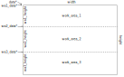

# Process Functions
*Process functions* refer to the various operations that may be performed on
input data using an associated kernel. Our primary process function is the
*convolute* function.

Our process functions are generally developed for single-threaded operation.

Some process functions may be used in a multi-threaded manner, such as our image
processing since the image can be divided into regions easily.
 - I was originally thinking of making a general function called `process_threaded`
   which would take the number of threads to use as the first parameter, along
   with a function pointer to the specific process (e.g. `convolute`) and its
   necessary input/output data.
 - Since I am not confident this method is generalizable for all types of process
   functions and kernels nor may the input/output data be decomposable similarly
   for threaded operation, I am just making a specific function called `convolute_threaded`.
   We can generalize this function in the future.

## `convolute_threaded`

 - Principally working on image processing so this function will be developed for
   consideration of 2D input data stored in row-ordered arrays.
   - Since the input data is stored in row-ordered arrays, this function will partition
     the working areas by rows. The number of threads specified equals the number
     of work areas defined. The necessary bounds are computed for each work area and
     the threads created which call the single-thread `convolute` function with the
     assigned work area bounds.
     - Each work thread will need the following bounds data computed for each work area:
       - `height` - Will need to be adjusted for the work area. `width` will be the same
         because we are only dividing the input image into row groups.
       - `input data` - The `convolute_threaded` function accepts image data as a
         pointer to the start. Each work area will need to have this input pointer
         adjusted for the calls to `convolute`.
       - `output data` - This is also provided as a pointer and needs the same adjustment
         as `input data`.

__Image Work Areas__ \

 - Current plan is to have `convolute_thread` create the threads via the `async()`
   function.
   - This won't let us have much control over tweaking thread creation and settings
     but is a start for us to compare multi-threading with single-threading processing.
   - The main thread will join on these other threads by calling `get()` on all the
     objects returned from the `async()` function. The values returned from `get()`
     will be status information.
     - `0` - Thread operation completed successfully.
     - `1` - Error occurred during thread's operation.
   - The main thread will sum the return values and any result greater than `0` will
     indicate an error for the overall process operation.
   - If we continue to use `async()` for creating the threads, this status return
     value could be expanded to return various error types by flag bits. Probably still
     won't have much information or control over which individual thread caused the
     issue.
 - When processing pixels on the edges of an image, the kernel overhangs and uses pixel
   values extended from the edge. This complicates the process of using multiple threads
   to process their work areas because a simple reuse of our single-threaded convolute
   makes the kernel make up pixels that extend beyond the work area yet are still within
   the image. This requires a tweak or rewrite of our convolute function to use these
   existing values even though they extend just beyond the assigned work area.
