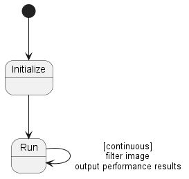

# Zephyr Filter Tool
The *Zephyr Filter Tool* is an adaptation of the general *Filter Tool* to do
performance testing on the Zephyr based STM32 ARM platform.

This tool simple runs a vertical lines test pattern image of 256x256x1 through a
gaussian kernel while timing the processing time. Once processing is complete,
the timing results are output through the serial port and the cycle repeats
immediately.

## Notes
 - Originally, the on-board LED was going to flash to alert the user that the
   module was up and running but the current code does this by using a sleep delay.
   This is incompatible with our continuous filter loop running.
   - Will remove flashing LED until another option is implemented. It is nice to
     give the flashing feedback to the user that the system is running.
   - Instead of sleeping, could just read a counter to determine when to flash but
     our filters can take longer than the flash cycle. Even if the filter had a
     run time less than the LED flash cycle, the filter run does take time to
     process and will probably cause the flash cycle to be missed/delay and result
     in a somewhat erratic LED flash cycle.
   - Could put the LED flash cycle control on an interrupt but this will probably
     affect our filter performance timing.
     - This seems the only option available, though the interrupt is not expected to have
       a measurable effect on our timing analysis.
   - Best option now seems to be tying the LED flash to a PWM to control. We
     would be able to configure the PWM and pretty much forget about controlling
     the LED once it is initialized.
     - Does our module support PWM at the slow speed of 1 Hz? *No*
       - Reviewed the schematic for the STM32F7508-DK board. The onboard LD1 is the only
         one that is controllable by the processor. This is attached to pin labeled
         PI1/D13/SCK/SPI2_SCK which doesn't look like it has a PWM. However, the datasheet
         shows that TIM8_BKI N2 can be mapped to PI1 as alternate function 3 (AF3), so we
         may still be able to use the onboard LED.
       - Again, however, section 22.1 of the processor manual states "Pulse lengths and
         waveform periods can be modulated from a few microseconds to several milliseconds
         using the timer prescaler and the RCC clock controller prescalers." So it doesn't
         look like we will be able to use any PWM for our 1Hz LED.